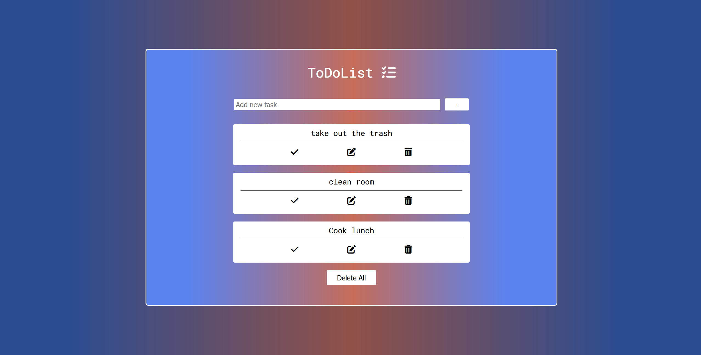
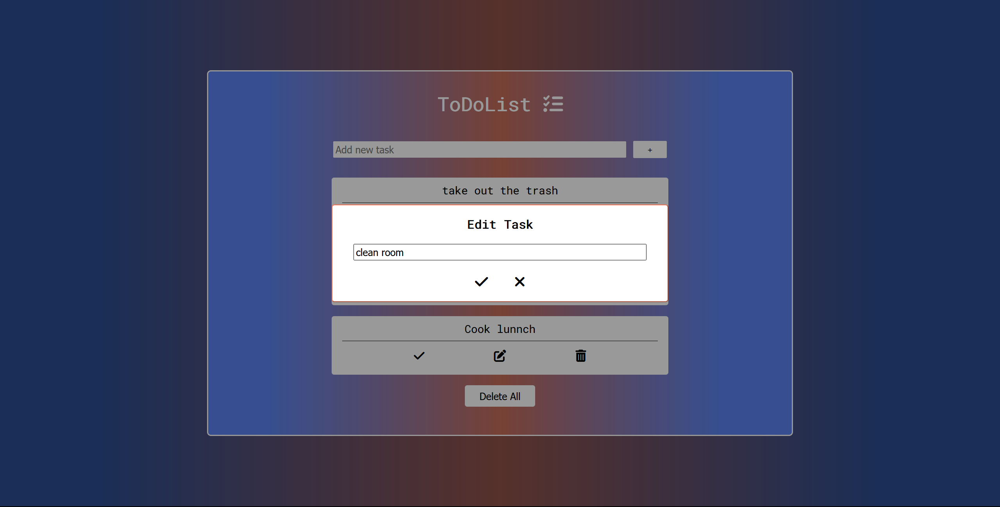

# To Do List

**Hello!**

This is my next project, thanks to which I have increased my skills and knowledge of JavaScript.

**In the app, you can add, edit and delete tasks.**

You can enter tasks with the click of a button "+" or by pressing enter.

In the task editing popup you can:
Save the change by clicking the button or pressing enter.
Close the popup by clicking the button or pressing the esc key.

## Screenshots

## 🔗 Live Site
[Live Site Here!](https://camillematernacci.github.io/To-Do-List/)

## 🛠 Technologies used

     

